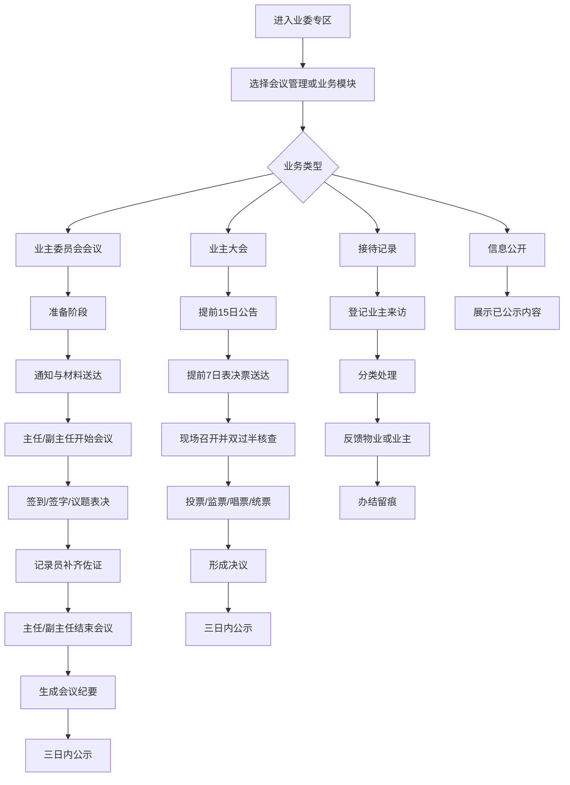

# 业委专区流程文档

文档版本：V0.1  
适用范围：基于当前“业委专区”移动端原型，用于说明业主委员会日常工作、业委会会议管理、接待记录和信息公开的业务流程。

> 2026-06-18 范围变更：产品只给业委会内部使用，业主大会模块停用。新版本不再采集全体业主花名册、房屋面积、户代表、业主大会签到/投票/双过半核算等信息；历史章节和历史表仅作为旧方案留档。

## 1. 产品定位

“业委专区”用于支撑业主委员会规范化运作，核心目标是把会议发起、通知送达、参会表决、记录留痕、公示公开、业主接待等工作线上化、流程化、可追溯。

当前设计框架采用移动端工作台结构：

- 首页展示会议管理、接待记录、学习培训、资料库、信息公开等业委会内部履职入口。
- 会议管理聚焦“业主委员会会议”流程。
- 业主委员会会议已按准备阶段、进行中、会议结束三个阶段推进，并且已做身份视角区分。
- 业主大会相关流程已停用，不再作为当前版本功能范围。
- 接待记录用于登记业主诉求、跟进处理结果，并区分是否需要反馈物业。
- 信息公开用于对业主展示已公示的会议纪要、决定和公告。

### 1.1 当前实现边界

当前原型中，“角色区分”主要落在业主委员会会议模块：

- 主任/副主任：负责新建、开始、结束会议，并处理会议有效性判断。
- 委员：处理本人签到、签字和议题表决。
- 记录员：维护送达、代录签到签字、上传佐证、维护议题和公示留痕。
- 业主/物业：查看已公示内容，内部会议流程不可见。

业主大会模块当前更偏“管理端流程展示”，尚未形成完整的业主、业委会成员、记录员、监督员、物业等角色分屏。后续如果继续扩展，应把业主大会单独拆成多角色流程。

## 2. 角色与权限

本节权限说明以当前已实现较完整的“业主委员会会议”模块为主。业主大会相关角色权限目前属于后续扩展方向。

| 角色 | 主要职责 | 关键权限 |
| --- | --- | --- |
| 主任 | 召集和主持会议，控制会议阶段 | 新建会议、开始会议、结束会议、判定会议有效性、查看纪要、公示结果 |
| 副主任 | 协助主任开展工作 | 与主任拥有同类会议推进权限 |
| 委员 | 参与会议和议题表决 | 查看本人会议、签到、签字、对议题投赞成/反对/弃权票 |
| 记录员 | 维护会议流程材料 | 维护通知送达、材料送达、代录签到签字、上传佐证、维护议题和公示留痕 |
| 业主 | 查看公开信息 | 查看已公示会议纪要与决定，不可查看内部筹备和表决过程 |
| 物业 | 查看相关公开信息和接待处理事项 | 以物业视角查看公开内容，接收物业类问题反馈 |

权限设计原则：

- 内部会议流程仅业委会成员和记录员可见。
- 业主、物业仅能查看依法公示后的内容。
- 会议新建、开始、结束由主任或副主任操作。
- 记录员负责材料维护和留痕，不参与委员表决。
- 委员只处理本人参会动作，不负责推进会议阶段。

## 3. 总体流程

## 4. 业主委员会会议流程

### 4.1 新建会议

触发角色：主任、副主任。  
入口：业委专区首页 - 会议管理 - 业主委员会 - 新建业委会会议。

填写信息：

- 会议标题。
- 会议日期。
- 会议时间。
- 会议地点。
- 会议议题。
- 会议阶段，默认为准备阶段。

系统结果：

- 生成一条业主委员会会议记录。
- 默认进入“准备阶段”列表。
- 将业委会委员名单作为通知和材料送达对象。

### 4.2 准备阶段

目标：完成会前通知和会议材料送达。

记录员操作：

- 标记每位委员的会议通知送达状态。
- 标记每位委员的会议材料送达状态。
- 补齐必要的送达留痕。

主任/副主任查看：

- 查看通知送达进度。
- 查看材料送达进度。
- 判断是否可开始会议。

委员查看：

- 查看本人会议通知是否已送达。
- 查看本人会议材料是否已送达。
- 如未送达，页面提示由记录员负责处理。

阶段门槛：

- 会议日期必须已设置。
- 会议通知须送达全体委员。
- 会议材料须送达全体委员。
- 满足以上条件后，主任/副主任可点击“开始会议”。

异常处理：

- 会议日期缺失：提示先补填会议日期。
- 通知或材料未全部送达：会议暂不可开始。
- 会议取消：主任/副主任可在准备阶段取消会议。

### 4.3 进行中阶段

目标：完成签到、签字、议题表决和记录佐证。

委员操作：

1. 签到确认。
2. 签字确认，表示本人确认会议记录。
3. 对议题进行表决，可选择赞成、反对、弃权。

记录员操作：

- 维护会议议题。
- 代录线下签到和签字情况。
- 上传纸质签到表、会议记录照片等佐证。
- 标记是否存在决定事项。
- 标记是否存在重大事项。
- 维护居委会委员签字状态。

主任/副主任操作：

- 查看会议出席总览。
- 查看签到人数是否过半。
- 查看会议记录签字是否过半。
- 查看决议表决状态。
- 根据系统核查结果结束会议、带说明结束，或判定会议无效。

会议有效性核查规则：

- 委员签到人数须过半。
- 会议记录委员签字须过半。
- 涉及决定事项时，委员签字仍须过半。
- 涉及重大事项时，须有居委会委员签字。
- 线下佐证应归档，未上传时属于记录瑕疵，可提示补充。

议题表决规则：

- 每个议题独立统计表决结果。
- 赞成票达到委员过半，则该议题通过。
- 未达到过半且仍有人未投票，则显示待继续表决。
- 全部投票后仍未达到过半，则该议题未通过。
- 会议无效时，本次所有议题均不形成有效决议。

### 4.4 结束阶段

触发角色：主任、副主任。

系统根据会议记录给出分级结果：

| 结果 | 含义 | 系统动作 |
| --- | --- | --- |
| 会议有效 | 签到、签字、表决和关键记录满足要求 | 可正常结束并进入公示 |
| 会议有效但有瑕疵 | 关键条件满足，但仍有佐证或个别记录需说明 | 可带说明结束并归档 |
| 会议无效 | 未达到法定人数或关键记录无法证明会议成立 | 会议归档留痕，决议不生效 |

会议无效处理：

- 系统提示无效原因。
- 本次记录保留为未成立记录。
- 不计入有效已召开会议次数。
- 可自动生成一条“重新召开”的会议进入准备阶段。

### 4.5 会议纪要

生成规则：

- 系统根据会议名称、时间、地点、出席情况、议题、表决结果、签字情况和会议结论自动生成会议纪要。
- 会议进行中时为草稿。
- 会议结束后形成定稿。

纪要内容包含：

- 会议名称。
- 会议时间。
- 会议地点。
- 参会情况。
- 会议议题。
- 表决结果。
- 签字确认情况。
- 会议有效性和结论。

### 4.6 三日内公示

适用对象：已结束且有效的会议。

规则：

- 会议纪要与决定应在会议结束后三日内向全体业主公示。
- 未超过期限时，可发起公示。
- 超过期限后，不再补公示，并计入年度考核扣分。
- 已公示内容同步至“信息公开”，业主和物业可见。

状态说明：

| 状态 | 含义 |
| --- | --- |
| 待公示 | 会议已结束，仍在三日公示期限内 |
| 已公示 | 在期限内完成公示 |
| 逾期公示 | 超过截止日后才公示，计入扣分 |
| 逾期未公示 | 超过三日仍未公示，系统锁定并计入扣分 |

## 5. 业主大会流程

当前业主大会模块已具备会议公告、表决票送达、双过半核查、投票计票、决议公示等流程要素，但尚未像业主委员会会议一样完成细颗粒度角色区分。因此本章按“流程框架”描述，可作为下一阶段拆分角色视图的依据。

### 5.1 新建业主大会

触发角色：主任、副主任。

填写信息：

- 会议类型，如定期大会、临时大会。
- 会议标题。
- 会议日期。
- 会议时间。
- 会议地点。
- 会议议题。
- 是否涉及表决投票。

规则提示：

- 20%业主联署可发起相关大会。
- 须提前15日书面通知全体业主。
- 到场业主人数和专有部分面积均须过半，方可召开。
- 重大事项须达到法定比例后才可通过。

### 5.2 会前公告与通知

目标：提前15日完成会议公告和通知覆盖。

操作项：

- 发布会议公告。
- 确认公告内容完整、齐全。
- 标记通知覆盖全体业主。
- 查看通知覆盖率。

阶段门槛：

- 通知覆盖全体业主。
- 公告已发布。
- 公告内容完整。
- 若临近或超过通知截止日，系统展示紧急或逾期提示。

### 5.3 表决票送达

适用对象：涉及表决事项的业主大会。

目标：提前7日完成表决票送达。

操作项：

- 标记表决票送达进度。
- 标记送达记录和凭证完整。
- 如存在非当面送达，需发布非当面送达公告并留存。

不涉及表决事项时：

- 系统提示无需送达表决票。
- 会议可作为情况通报或听取意见流程处理。

### 5.4 现场召开

目标：核查业主大会是否达到“双过半”召开条件。

记录项：

- 到场户数。
- 到场面积。
- 全体业主户数。
- 全体专有部分面积。
- 街道办或居委会监督员签字。

双过半规则：

- 到场业主人数过半。
- 到场专有部分面积过半。
- 两项均满足时，大会达到法定人数要求。

异常状态：

- 人数和面积均未过半：会议不成立。
- 仅人数过半或仅面积过半：会议仍不满足双过半要求。

### 5.5 投票、监票、唱票、统票

适用对象：涉及表决事项的业主大会。

现场流程：

1. 指定时间地点投票。
2. 现场监票。
3. 公开唱票。
4. 当场统票。

佐证材料：

- 签到册。
- 投票单。
- 公告照片。
- 会议记录。
- 计票或唱票材料。

### 5.6 决议与公示

会议结束后：

- 系统根据出席人数、面积、投票结果和流程材料判断会议是否有效。
- 有效会议形成决议。
- 无效会议保留为未成立记录，相关决议不生效。
- 决议须在会后三日内公告。

业主大会规范化评分项：

- 提前15日发布会议公告。
- 会议公告内容完整、齐全。
- 提前7日将表决票送达全体业主。
- 表决票送达记录、凭证完整。
- 非当面送达时已发布送达方式公告。
- 指定时间地点投票、监票、唱票、统票。
- 计票现场签到、唱票等材料齐全规范。
- 依法形成决议。
- 决议在会后3日内公告。

## 6. 接待记录流程

### 6.1 接待制度公示

接待制度包含：

- 定时：接待时间。
- 定点：接待地点。
- 定人：接待人员。

流程：

1. 维护接待制度信息。
2. 标记是否向全体业主公开。
3. 已公示时，业主可了解接待安排。
4. 如需调整，可编辑或取消公示。

### 6.2 新建接待记录

填写信息：

- 来访业主。
- 房号。
- 接待人。
- 接待日期。
- 接待时间。
- 诉求类型。
- 诉求内容。
- 处理结果。

诉求类型：

- 物业类。
- 公共事务。
- 邻里纠纷。
- 其他。

### 6.3 跟进与办结

处理规则：

- 物业类问题需要向物业企业反馈。
- 所有问题均应向业主反馈处理情况。
- 业主诉求已反馈解决，且物业类问题已向物业反馈后，视为办结。

状态判断：

| 状态 | 条件 |
| --- | --- |
| 待处理 | 尚未形成处理结果或未反馈业主 |
| 待反馈物业 | 属于物业类，但尚未向物业反馈 |
| 已办结 | 已向业主反馈，且物业类事项已向物业反馈 |

## 7. 信息公开流程

信息公开面向业主和物业展示依法公开内容。

公开范围：

- 已公示的业主委员会会议纪要。
- 已公示的会议决定。
- 已公示的业主大会决议。
- 接待制度公开信息。

限制规则：

- 未结束或未公示的会议不向业主、物业展示内部详情。
- 无效会议不作为有效决议展示。
- 业主和物业只能查看公开内容，不可进入内部流程操作。

## 8. 业务学习流程

当前框架包含业务学习入口，用于沉淀业委会培训和学习记录。

学习记录包含：

- 培训标题。
- 培训日期。
- 培训时间。
- 培训地点。
- 主讲人。
- 学习阶段。
- 完成进度。
- 参训对象。

适用场景：

- 物业管理条例解读。
- 消防安全知识学习。
- 业委会议事规则学习。
- 换届选举流程培训。
- 财务管理专项培训。
- 物业维修资金监管专项培训。
- 法律风险防范培训。

## 9. 数据留痕要求

系统应保留以下关键记录：

- 会议基础信息。
- 通知送达记录。
- 材料送达记录。
- 签到记录。
- 签字确认记录。
- 议题与表决结果。
- 居委会或街道监督签字。
- 线下佐证附件。
- 会议纪要。
- 公示时间。
- 逾期或无效原因。
- 接待登记与处理反馈记录。

## 10. 异常处理清单

| 场景 | 系统提示或处理 |
| --- | --- |
| 会议日期未填 | 提示补填日期，暂不可发送或开始会议 |
| 通知未全部送达 | 主任/副主任不可开始会议 |
| 材料未全部送达 | 主任/副主任不可开始会议 |
| 签到未过半 | 会议不成立，决议不生效 |
| 签字未过半 | 关键记录待补正，不可正常归档 |
| 重大事项缺居委会签字 | 重大事项决议无效或需说明 |
| 佐证材料缺失 | 会议可成立但记录有瑕疵，提示补充归档 |
| 业主大会未达双过半 | 大会不成立，决议不生效 |
| 逾期未公示 | 锁定补公示，计入年度考核扣分 |
| 物业类接待未反馈物业 | 接待记录不可视为办结 |

## 11. 页面与模块对应关系

| 页面/入口 | 对应流程 |
| --- | --- |
| 业委专区首页 | 工作台入口、统计概览、功能导航 |
| 会议管理 | 区分业主委员会会议与业主大会 |
| 业主委员会 | 例会三阶段跟踪、会议纪要、公示 |
| 业主大会 | 大会召开记录、双过半核查、决议存档 |
| 接待记录 | 来访登记、分类处理、反馈留痕 |
| 信息公开 | 已公示纪要和决定面向业主展示 |
| 业务学习 | 培训学习记录和知识沉淀 |
| 个人中心 | 身份切换、个人权限视图 |

## 12. 后续完善建议

- 优先补齐业主大会的角色区分，把当前管理流程拆成主任/副主任、记录员、业主、街道或居委会监督员、物业等不同视角。
- 为业主大会增加业主端参会入口，支持查看公告、确认表决票送达、参与投票或查看投票结果。
- 为业主大会增加监督员视角，支持确认现场监督、监票唱票统票、签字留痕。
- 增加真实附件上传能力，用于保存签到表、会议记录、公告照片和投票单。
- 增加审批流或电子签章能力，用于会议纪要、决议和公示确认。
- 增加消息通知能力，在送达、公示截止、待表决时提醒相关人员。
- 增加操作日志，记录每一次状态变更、修改人和修改时间。
- 增加导出能力，支持导出会议纪要、会议台账、接待台账和公示记录。
- 增加年度考核报表，自动统计按时公示、逾期公示、未成立会议和规范化评分。
